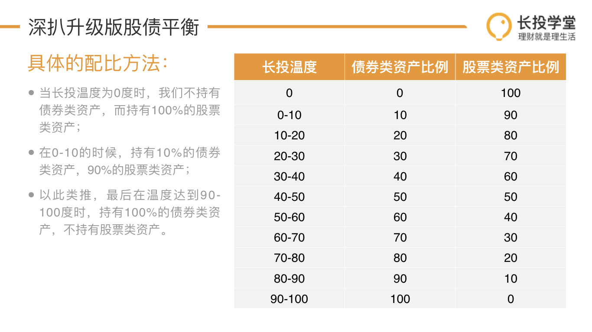

# 第十课笔记

> [回基金进阶目录](/ichangtou/fund/middle-level)

#### 2020-02-26

## 股债平衡

总的来说，各种指数基金、QDII基金、可转债基金，都还是于股票有关系，长期来看还是正相关的

如果需要做投资配置，一般来做都需要配置*债券类资产*

用[初级课的股债平衡策略](./ichangtou/fund/primary/README.md#第十三课笔记)，虽然收益率比较下，单纯股权类资产和股债平衡区别不大；但是单纯投资股权类资产，需要承受等多因为市场波动而产生的心理压力

根据股票市场的波动，我们需要在市场大热的时候减持更多的股权类资产，以减轻股权资产在市场整体下跌时带来的损失；而市场遇冷的时候则应该增持更多的股权类资产，在市场上涨的时候获得更高的收益

如果一味遵循`股权:债券 = 1:1`的这个比例进行调仓的话，会让我们错过不少的收益，也可能承受一定的风险

为避免此类情况，可以根据中证全指的长投温度来进行更灵活的平衡操作，当中证全指温度高时，多减持股票类资产；当中证全指温度低时，多增持股票类资产

**平衡可参考下表的比例进行调整：**

